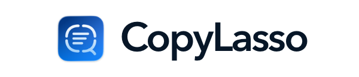

<p align="center">
  
</p>

# CopyLasso

[](https://github.com/bennetthilberg/copylasso/actions/workflows/ci.yml)

CopyLasso is a free, open-source macOS app that copies text and supported codes
from anywhere on your screen. Press your keyboard shortcut and drag over the
content. CopyLasso puts the result on your clipboard. The default shortcut is
`Command-Shift-2`.

Recognition runs on your Mac with Apple Vision. CopyLasso does not upload or
save screenshots.

## Install CopyLasso

CopyLasso 0.3.1 is the latest release. It requires macOS 14 or later and runs
natively on Apple silicon and Intel Macs.

1. Download [CopyLasso 0.3.1](https://github.com/bennetthilberg/copylasso/releases/tag/v0.3.1).
2. Open `CopyLasso-0.3.1.dmg`.
3. Drag CopyLasso to Applications, then open it.
4. Follow the setup prompts and grant Screen Recording access when macOS asks.

To verify the download, place the DMG and checksum file in the same folder and
run:

```sh
shasum -a 256 -c CopyLasso-0.3.1.dmg.sha256
```

The command should print `CopyLasso-0.3.1.dmg: OK`.

## Use CopyLasso

1. Press your keyboard shortcut or choose **Capture** from the menu bar.
2. Drag over text or a supported code. Press `Esc` to cancel.
3. Paste the recognized content into another app.

CopyLasso recognizes ordinary text plus QR, Code 128, Data Matrix, PDF417, and
Aztec codes. Code payloads are copied as plain text; CopyLasso never opens or
runs them.

Open Settings to change the shortcut, choose OCR languages, control update
checks and sound, start CopyLasso at login, or enable capture history.

Capture history is optional and off by default. When enabled, it stores only
successful text and code results in an encrypted local archive. It never stores
screenshots.

## Privacy

CopyLasso has no accounts, analytics, telemetry, cloud OCR, or content upload.
Screen capture and recognition stay on your Mac. The app uses the network only
to check its authenticated update feed, and you can turn off automatic checks.

Read [Privacy](PRIVACY.md) for data-handling details. To report a vulnerability,
follow the instructions in [Security](SECURITY.md).

## Limitations

- OCR works best with clear, horizontal text. Handwriting, rotated text, tables,
  and complex layouts can be less accurate.
- Each selection must stay on one display.
- macOS can block capture of protected content.

## Build from source

Open `CopyLasso.xcodeproj` in Xcode 26.6 and run the `CopyLasso` scheme. To run
the repository's formatting, build, test, coverage, offline, and Universal 2
checks, use:

```sh
./scripts/ci.sh
```

See [Contributing](CONTRIBUTING.md) before submitting a change. Third-party
dependencies and licenses are listed in [Third-party notices](THIRD_PARTY_NOTICES.md).

## License

CopyLasso is available under the [MIT License](LICENSE).
