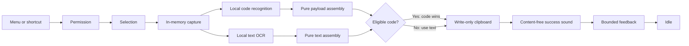

# Capture Workflow

G18 connects the menu and global shortcut to one production operation without placing private content in observable application state. G38 extends that same operation with concurrent local text and code recognition while retaining one Capture command, shortcut, permission, selection, screen capture, output, lifecycle, and busy-state boundary.

## State And Service Flow

`CaptureCoordinator` stores only a payload-free phase. `CaptureCommand` is the single root-owned invocation boundary used by the menu command and configurable global shortcut. A request received in any non-idle phase is rejected without creating another overlay, capture, recognition request, clipboard write, sound, or HUD. Permission recovery retries that same unified operation.

## Concurrent Recognition and Precedence

`VisionBarcodeService` is the only production Vision barcode adapter. It pins `VNDetectBarcodesRequestRevision3` and requests only QR, Code 128, Data Matrix, PDF417, and Aztec. It performs recognition in a cancellable detached task concurrently with OCR and converts Vision results to neutral observations before returning to the shared workflow.

`CodePayloadAssembler` is pure and framework-neutral. It rejects unsupported symbologies, nil or empty payloads, and nonfinite or nonpositive geometry. Eligible observations are grouped by vertical overlap, ordered top-to-bottom and left-to-right with deterministic ties, then exact duplicate payloads are removed. One payload is preserved byte-for-byte as a Swift string, multiple unique single-line payloads are joined with one newline, and multiple unique payloads containing any carriage return or line feed produce an ambiguity result without a clipboard write. Payloads are never trimmed, parsed, validated as URLs, opened, or otherwise acted on.

## Private Data Lifetime

After selection, one private async function owns the selected geometry, captured `CGImage`, neutral text and code observations, and the winning full assembled string. The geometry carries the initiating display point size and scale; the capture adapter compares them with a fresh ScreenCaptureKit display snapshot before requesting pixels. The function returns only:

- a unified no-result or code-ambiguity value; or
- a text/code-specific success with a whitespace-normalized preview bounded to 80 extended grapheme clusters after the full string has been written.

Returning from that function ends the image, observations, and unbounded text or payload scope before the feedback service begins its 2.5-second presentation. Neither those values nor the preview enters `CaptureCoordinator`, preferences, logs, caches, analytics, or history. Integration tests hold success and failure feedback open while proving the captured image has already been released.

## Completion, Cancellation, And Failure

- Success, no-text-or-code, and code-ambiguity enter `completing` only while presenting feedback, then return immediately to idle while the feedback panel owns its independent dismissal timer. A new idle capture may therefore dismiss visible feedback and begin selection without waiting for that timer.
- Only a successful nonempty clipboard write requests one success sound. Every cancellation, no-result, ambiguity, and failure before or during the clipboard write is silent. Playback never receives private content and never blocks completion.
- Escape, too-small selection, display change, application termination, and recognition cancellation are non-error cancellation outcomes. They never write the clipboard or show generic failure feedback.
- Ordinary selection, capture, recognition, clipboard, and feedback errors are classified only by stage. Raw platform errors and content never enter observable state or user copy.
- A real capture-time Screen Recording denial uses the specific permission-recovery panel rather than stacking a generic failure HUD.
- Selection records and restores another frontmost application only when it actually activates CopyLasso for the system crosshair. If Settings or About was already active, overlay cleanup proceeds directly to capture, OCR, sound, and the nonactivating HUD instead of waiting for a later application-resign event.
- Terminal cancellation or failure is explicitly reset only after the operation has unwound.
- Sleep, screen sleep, and lock/session resign request `.systemInterrupted`; application termination requests `.applicationTerminated`. The root-owned task propagates cancellation through capture, OCR, and feedback, while selection receives an explicit synchronous cleanup request. Wake/unlock never retries automatically.

The clipboard adapter is intentionally write-only. Cancellation and every failure before the pasteboard call preserve prior clipboard contents. A rare AppKit failure after the pasteboard has been cleared cannot restore prior contents without a prohibited read; that documented platform tradeoff remains unchanged.

## Verification Boundary

The canonical suite injects every service, exercises all branch classes, performs 25 consecutive successful operations, 20 alternating success/cancel cycles, and 100 alternating text/code results, rejects overlapping Capture work, proves the menu and shortcut route through the same command, proves both recognizers start concurrently and code wins over simultaneous text, and cancels pending selection, capture, recognition, sound, and feedback work. Real Vision tests cover all five symbologies, rotations, degradation, damage, compositions, and duplicates with deterministic project fixtures. The signed manual matrix remains necessary for arbitrary app pixels, full-screen Spaces, real paste targets, physical displays, sleep/wake, lock/unlock, and actual audio-output behavior.
