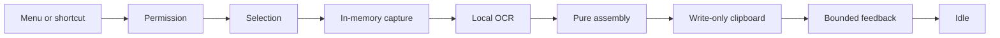

# Capture Workflow

G18 connects the menu and global shortcut to one production operation without placing private content in observable application state.

## State And Service Flow

`CaptureCoordinator` stores only a payload-free phase. `CaptureCommand` is the single root-owned invocation boundary used by the menu and `GlobalShortcutController`. A request received in any non-idle phase is rejected without creating another overlay, capture, OCR request, clipboard write, or HUD.

## Private Data Lifetime

After selection, one private async function owns the selected geometry, captured `CGImage`, neutral OCR observations, and full assembled string. It returns only:

- `.noText`; or
- `.success` with a whitespace-normalized preview bounded to 80 extended grapheme clusters after the full string has been written.

Returning from that function ends the image, observations, and unbounded-text scope before the feedback service begins its 2.5-second presentation. Neither those values nor the preview enters `CaptureCoordinator`, preferences, logs, caches, analytics, or history. Integration tests hold success and failure feedback open while proving the captured image has already been released.

## Completion, Cancellation, And Failure

- Success and no-text stay in `completing` until feedback dismissal, then return directly to idle.
- Escape, too-small selection, display change, application termination, and OCR cancellation are non-error cancellation outcomes. They never write the clipboard or show generic failure feedback.
- Ordinary selection, capture, recognition, clipboard, and feedback errors are classified only by stage. Raw platform errors and content never enter observable state or user copy.
- A real capture-time Screen Recording denial uses the specific permission-recovery panel rather than stacking a generic failure HUD.
- Terminal cancellation or failure is explicitly reset only after the operation has unwound.

The clipboard adapter is intentionally write-only. Cancellation and every failure before the pasteboard call preserve prior clipboard contents. A rare AppKit failure after the pasteboard has been cleared cannot restore prior contents without a prohibited read; that documented platform tradeoff remains unchanged.

## Verification Boundary

The canonical suite injects every service, exercises all branch classes, performs 25 consecutive successful operations and 20 alternating success/cancel cycles, rejects concurrent work, and proves menu and shortcut use the exact same command. The signed manual matrix remains necessary for arbitrary app pixels, full-screen Spaces, real paste targets, and physical displays.
