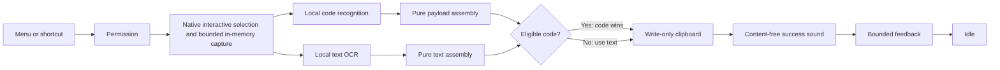

# Capture Workflow

G18 connects the menu and global shortcut to one production operation without placing private content in observable application state. G38 extends that same operation with concurrent local text and code recognition, and G46 pairs macOS's native interactive selector with the existing bounded ScreenCaptureKit capture boundary. The single Capture command, shortcut, permission, output, lifecycle, and busy-state policy remain unchanged.

## State And Service Flow

```mermaid
flowchart LR
  Request["Menu or shortcut"] --> Permission["Permission"]
  Permission --> Capture["Native interactive selection and bounded in-memory capture"]
  Capture --> OCR["Local text OCR"]
  Capture --> Barcode["Local code recognition"]
  OCR --> Assembly["Pure text assembly"]
  Barcode --> CodeAssembly["Pure payload assembly"]
  CodeAssembly --> Precedence{"Eligible code?"}
  Assembly --> Precedence
  Precedence -->|"Yes: code wins"| Clipboard["Write-only clipboard"]
  Precedence -->|"No: use text"| Clipboard
  Clipboard --> Sound["Content-free success sound"]
  Sound --> Feedback["Bounded feedback"]
  Feedback --> Idle["Idle"]
```

`CaptureCoordinator` stores only a payload-free phase. `CaptureCommand` is the single root-owned invocation boundary used by the menu command and configurable global shortcut. A request received in any non-idle phase is rejected without creating another overlay, capture, recognition request, clipboard write, sound, or HUD. Permission recovery retries that same unified operation.

## Concurrent Recognition and Precedence

`VisionBarcodeService` is the only production Vision barcode adapter. It pins `VNDetectBarcodesRequestRevision3` and requests only QR, Code 128, Data Matrix, PDF417, and Aztec. It performs recognition in a cancellable detached task concurrently with OCR and converts Vision results to neutral observations before returning to the shared workflow.

`CodePayloadAssembler` is pure and framework-neutral. It rejects unsupported symbologies, nil or empty payloads, and nonfinite or nonpositive geometry. Eligible observations are grouped by vertical overlap, ordered top-to-bottom and left-to-right with deterministic ties, then exact duplicate payloads are removed. One payload is preserved byte-for-byte as a Swift string, multiple unique single-line payloads are joined with one newline, and multiple unique payloads containing any carriage return or line feed produce an ambiguity result without a clipboard write. Payloads are never trimmed, parsed, validated as URLs, opened, or otherwise acted on.

## Private Data Lifetime

After selection, one private async function owns the ScreenCaptureKit `CGImage`, neutral text and code observations, and the winning full assembled string. No encoded screenshot bytes enter CopyLasso. The function returns only:

- a unified no-result or code-ambiguity value; or
- a text/code-specific success with a whitespace-normalized preview bounded to 80 extended grapheme clusters after the full string has been written.

Returning from that function ends the image, observations, and unbounded text or payload scope before the feedback service begins its 2.5-second presentation. Neither those values nor the preview enters `CaptureCoordinator`, preferences, logs, caches, analytics, or history. Integration tests hold success and failure feedback open while proving the captured image has already been released.

## Completion, Cancellation, And Failure

- Success, no-text-or-code, and code-ambiguity enter `completing` only while presenting feedback, then return immediately to idle while the feedback panel owns its independent dismissal timer. A new idle capture may therefore dismiss visible feedback and begin selection without waiting for that timer.
- Only a successful nonempty clipboard write requests one success sound. Every cancellation, no-result, ambiguity, and failure before or during the clipboard write is silent. Playback never receives private content and never blocks completion.
- Escape status, a too-small drag, application termination, Control-modifier interruption, unsupported Shift/Option/Space adjustment, and recognition cancellation are non-error cancellation outcomes. They never call CopyLasso's clipboard service or show generic failure feedback. A selector exit without a completed rectangle is cancellation or a capture-stage failure according to its termination status.
- Ordinary selection, capture, recognition, clipboard, and feedback errors are classified only by stage. Raw platform errors and content never enter observable state or user copy.
- A real capture-time Screen Recording denial uses the specific permission-recovery panel rather than stacking a generic failure HUD. When the selector returns without geometry, an async `SCShareableContent.current` probe authoritatively checks access before the result is classified as Escape; the probe captures no pixels and retains no shareable-content metadata.
- The global shortcut starts Apple's fixed interactive selector synchronously after granted preflight. macOS owns the native cursor and selection surface; CopyLasso neither activates itself nor changes another application's focus.
- Before launch, shortcut routing waits until its Shift/Option/Control modifiers are released. While the selector runs with its image destination fixed to `/dev/null`, CopyLasso samples only the current pointer position, left-button state, and Shift/Option/Space geometry-adjustment state at one-millisecond intervals. The tracker waits out a button already held when the selector starts, treats each later press/release pair as a candidate, rejects any candidate adjusted with those native geometry controls, and retains the final direct-drag candidate when the child exits. A tiny direct-access confirmation click therefore cannot prevent a later real drag. Half-open display bounds give each shared edge one owner, and a release on a different known display cancels instead of silently cropping the rectangle the native selector displayed. Valid same-display geometry is clamped to its initiating display and passed to the existing ScreenCaptureKit adapter, which revalidates the complete display bounds before returning selected pixels in memory. No subprocess image bytes, screenshot file, event monitor, event interception, or screenshot-pasteboard value enter CopyLasso.
- Control is rejected before selector launch and polled while it runs. If observed, the child is stopped and CopyLasso does not continue to pixel capture. Because the sampler does not intercept input, exact Control at mouse-up can still let macOS write its screenshot to the clipboard before cancellation. CopyLasso never reads that value. The same observe-only boundary can rarely retain a dragged first-use confirmation followed by Escape or miss an entire drag completed between samples. These accepted residuals avoid Accessibility or Input Monitoring permission and retain the physically reliable focus-free native selector.
- A nested interactive-capture scope owns the `InteractiveCaptureOutcome` and image through concurrent recognition, then returns only bounded feedback. That scope ends before the feedback service is called, matching the original overlay workflow's image-lifetime boundary.
- Cached selection geometry is accepted only after a normal selector-process exit. A signalled child is a capture failure even if the sampler observed a prior release.
- Terminal cancellation or failure is explicitly reset only after the operation has unwound.
- Sleep, screen sleep, and lock/session resign request `.systemInterrupted`; application termination requests `.applicationTerminated`. The root-owned task terminates the active selector process and propagates cancellation through OCR and feedback. Wake/unlock never retries automatically.

The clipboard adapter is intentionally write-only. Cancellation and every failure before the pasteboard call preserve prior clipboard contents. A rare AppKit failure after the pasteboard has been cleared cannot restore prior contents without a prohibited read; that documented platform tradeoff remains unchanged.

## Verification Boundary

The canonical suite injects every service, exercises all branch classes, pins the exact system executable and argument list, proves the selector returns no screenshot data, ignores a tiny confirmation click before the real drag, rejects Control, Shift/Option/Space-adjusted geometry, cross-display completion, and signalled termination, authoritatively rechecks permission after empty output, revalidates display bounds, suppresses stale completion, and proves interactive pixels are released before feedback. It also performs 25 consecutive successful operations, 20 alternating success/cancel cycles, and 100 alternating text/code results, rejects overlapping Capture work, proves the menu and shortcut route through the same command, proves both recognizers start concurrently and code wins over simultaneous text, and cancels pending capture, recognition, sound, and feedback work. Real Vision tests cover all five symbologies, rotations, degradation, damage, compositions, and duplicates with deterministic project fixtures. The signed manual matrix remains necessary for the native crosshair, arbitrary app pixels, focus preservation, full-screen Spaces, real paste targets, physical displays, sleep/wake, lock/unlock, the one-time macOS direct-access confirmation, and actual audio-output behavior.
