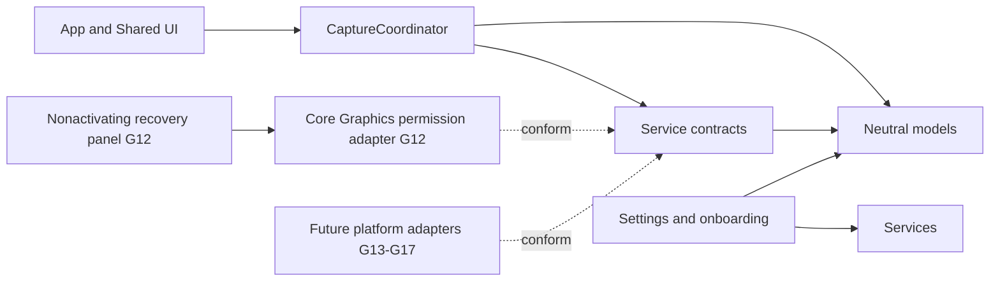

```mermaid
flowchart LR
  Request["Menu or shortcut request"] --> Permission["Permission service"]
  Permission --> Selection["Region selection service"]
  Selection --> Capture["Screen capture service"]
  Capture --> OCR["OCR service"]
  OCR --> Format["Pure text assembly"]
  Format --> Clipboard["Clipboard service"]
  Clipboard --> Feedback["Feedback service"]
  Feedback --> Idle["Idle"]
```

# Architecture Overview

CopyLasso currently provides a usable dockless shell and the first live boundary of its production capture architecture, not an end-to-end capture workflow. The application includes versioned onboarding, persistent Settings, Launch at Login, a configurable global shortcut, and production Screen Recording permission handling. Feasibility evidence from G05-G07 is retained in the ADRs, while the remaining production adapters are added incrementally in G13-G17 and connected in G18.

## Components and Dependency Direction

- `App` owns the dockless process, scene lifecycle, menu and shortcut command routing, and application termination boundary. `SharedUI` contains the menu, onboarding, Settings, and auxiliary-window presentation.
- `CaptureWorkflow` owns phase transitions and busy-state policy. Its G12 command slice invokes only permission and the temporary selection boundary.
- `Services` declares narrow permission, selection, capture, OCR, clipboard, and feedback boundaries. The Core Graphics permission adapter is isolated here.
- `Models` contains geometry, observations, authorization observations, and feedback values without AppKit, SwiftUI, ScreenCaptureKit, or Vision dependencies.
- `Settings` owns the typed `UserDefaults` adapter, onboarding-version policy, shortcut storage boundary, and observable settings controller. The system login-item adapter remains isolated in `Services`.

Dependencies point toward contracts and neutral models. UI and platform adapters may depend on them; models and workflow state must never depend on UI or live platform frameworks.

## Production Data Flow

The coordinator models the corresponding phases: idle, requesting permission, selecting, capturing, recognizing, completing, cancelled, and failed. It carries no image or recognized-text payload in observable state. Menu and global-shortcut requests reach the same `CaptureCommand`. G12 performs a user-initiated Core Graphics preflight, requests access only for a never-requested history, presents recovery for unavailable access, and reaches a temporary selection service after approval. That temporary service intentionally reports that G13 is not yet available, and the command resets to idle without capturing pixels. G18 will connect the complete service chain through a private transient operation context.

Cancellation is a normal result. It enters an explicit cancelled state and returns to idle only after a reset acknowledging cleanup. Failure records only the responsible stage, never captured content, recognized text, raw platform errors, or user data. A request received outside idle is rejected without changing state.

## Concurrency and Lifetime

- `CaptureCoordinator`, permission, selection, clipboard, and feedback contracts are main-actor isolated because they coordinate application or UI state.
- The Core Graphics permission adapter performs no work during construction or launch. The singleton recovery panel is nonactivating; only its explicit **Open System Settings** action changes focus.
- Capture and OCR contracts are asynchronous and `Sendable`. Their future adapters must not block the main actor.
- The production Vision adapter introduced in G15 will perform user-initiated recognition away from the main actor, following ADR-001.
- Geometry and future text assembly remain pure and independent of AppKit UI objects and Vision framework types.
- Images, recognized observations, assembled text, clipboard text, and feedback previews remain private transient values. They must be released after the active operation and must never be logged, persisted, or placed in observable coordinator state.

## Goal Ownership

| Goal | Responsibility |
| --- | --- |
| G09 | Dockless menu-bar shell and shared Capture Text command |
| G10-G11 | First-run state, persistent settings, Launch at Login, and the global shortcut invoking the shared capture command |
| G12 | Production permission service and recovery UI |
| G13 | Production AppKit selection adapter |
| G14 | Production ScreenCaptureKit region capture adapter |
| G15 | Production Vision OCR adapter |
| G16 | Pure observation-to-text assembly |
| G17 | Clipboard and nonactivating feedback adapters |
| G18 | End-to-end service orchestration, cleanup, and integration tests |

The G12 permission adapter and recovery panel are live. Selection remains a temporary unavailable service, while capture, OCR, clipboard, and feedback have only contracts and test doubles. No hidden pixel or text workflow exists.
