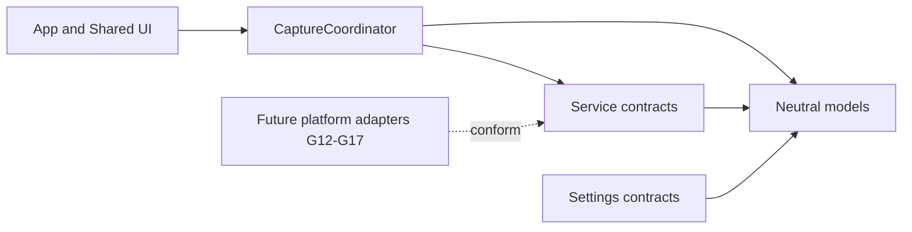

# Architecture Overview

CopyLasso currently provides a production-neutral architecture, not an end-to-end capture workflow. The application launches only the placeholder window. Feasibility evidence from G05-G07 is retained in the ADRs, while production platform adapters are added incrementally in G12-G17 and connected in G18.

## Components and Dependency Direction

- `App` owns process and scene lifecycle. `SharedUI` contains reusable SwiftUI presentation.
- `CaptureWorkflow` owns phase transitions and busy-state policy. It does not call platform APIs in G08.
- `Services` declares narrow permission, selection, capture, OCR, clipboard, and feedback boundaries.
- `Models` contains geometry, observations, authorization observations, and feedback values without AppKit, SwiftUI, ScreenCaptureKit, or Vision dependencies.
- `Settings` currently contains only permission-history state and its persistence contract. It does not implement `UserDefaults` or onboarding.

Dependencies point toward contracts and neutral models. UI and future adapters may depend on them; models and workflow state must never depend on UI or live platform frameworks.

## Future Data Flow

```mermaid
flowchart LR
  Request["Menu or shortcut request"] --> Permission["Permission service"]
  Permission --> Selection["Region selection service"]
  Selection --> Capture["Screen capture service"]
  Capture --> OCR["OCR service"]
  OCR --> Format["Pure text assembly"]
  Format --> Clipboard["Clipboard service"]
  Clipboard --> Feedback["Feedback service"]
  Feedback --> Idle["Idle"]
```

G08 models only the corresponding phases: idle, requesting permission, selecting, capturing, recognizing, completing, cancelled, and failed. It carries no image or recognized-text payload in observable state. G18 will own the private transient operation context and invoke the services in this order.

Cancellation is a normal result. It enters an explicit cancelled state and returns to idle only after a reset acknowledging cleanup. Failure records only the responsible stage, never captured content, recognized text, raw platform errors, or user data. A request received outside idle is rejected without changing state.

## Concurrency and Lifetime

- `CaptureCoordinator`, permission, selection, clipboard, and feedback contracts are main-actor isolated because they coordinate application or UI state.
- Capture and OCR contracts are asynchronous and `Sendable`. Their future adapters must not block the main actor.
- The production Vision adapter introduced in G15 will perform user-initiated recognition away from the main actor, following ADR-001.
- Geometry and future text assembly remain pure and independent of AppKit UI objects and Vision framework types.
- Images, recognized observations, assembled text, clipboard text, and feedback previews remain private transient values. They must be released after the active operation and must never be logged, persisted, or placed in observable coordinator state.

## Goal Ownership

| Goal | Responsibility |
| --- | --- |
| G09-G11 | Menu-bar shell, settings, and shortcut invocation of the coordinator entry point |
| G12 | Production permission service and recovery UI |
| G13 | Production AppKit selection adapter |
| G14 | Production ScreenCaptureKit region capture adapter |
| G15 | Production Vision OCR adapter |
| G16 | Pure observation-to-text assembly |
| G17 | Clipboard and nonactivating feedback adapters |
| G18 | End-to-end service orchestration, cleanup, and integration tests |

Until the owning goal is implemented, its service has only a contract and test double. G08 intentionally introduces no dependency container, live adapter, or hidden workflow.
