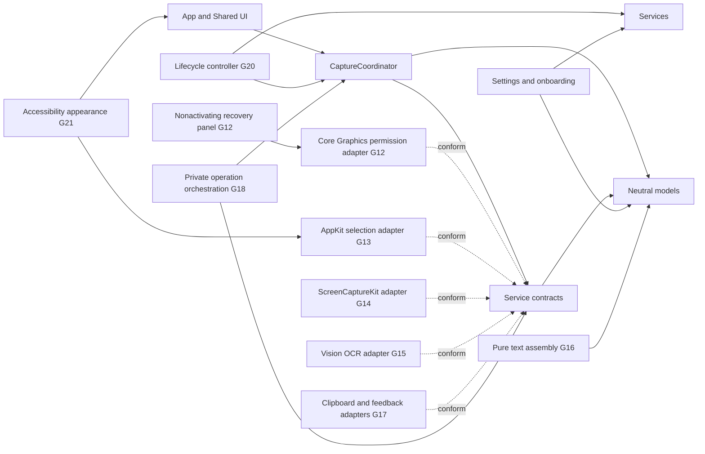

```mermaid
flowchart LR
  Request["Menu or shortcut request"] --> Permission["Permission service"]
  Permission --> Selection["Region selection service"]
  Selection --> Capture["Screen capture service"]
  Capture --> OCR["OCR service"]
  OCR --> Format["Pure text assembly"]
  Format --> Clipboard["Clipboard service"]
  Clipboard --> Feedback["Feedback service"]
  Feedback --> Idle["Idle"]
```

# Architecture Overview

CopyLasso currently provides a usable dockless shell plus one complete, stress-tested production service chain through clipboard output and nonactivating feedback. The application includes versioned onboarding, persistent Settings, Launch at Login, a configurable global shortcut, accessible native presentation, production Screen Recording permission handling, a lifecycle-safe multi-display selection overlay, in-memory ScreenCaptureKit region capture, local Vision OCR, deterministic text assembly, write-only plain-text output, and bounded HUD feedback. Feasibility evidence from G05-G07 is retained in the ADRs. G18 completed uniform cross-stage cleanup; G19-G21 harden display, lifecycle, and presentation behavior while retaining physical-environment release qualification.

## Components and Dependency Direction

- `App` owns the dockless process, scene lifecycle, menu and shortcut command routing, application termination boundary, and coalesced sleep/lock recovery. `SharedUI` contains the menu, onboarding, Settings, and auxiliary-window presentation.
- `CaptureWorkflow` owns phase transitions, busy-state policy, and the complete operation lifecycle. Its shared command invokes permission, production selection, capture, OCR, pure formatting, clipboard output, and bounded feedback. Cancellations and failures enter explicit terminal states and reset to idle after cleanup.
- `Services` declares narrow permission, selection, capture, OCR, clipboard, and feedback boundaries. The Core Graphics permission, AppKit selection, ScreenCaptureKit capture, and Vision OCR adapters are isolated here.
- `Models` contains geometry, observations, authorization observations, and feedback values without AppKit, SwiftUI, ScreenCaptureKit, or Vision dependencies.
- `Settings` owns the typed `UserDefaults` adapter, onboarding-version policy, shortcut storage boundary, and observable settings controller. The system login-item adapter remains isolated in `Services`.
- `SharedUI` owns explicit compound-control semantics, adaptive auxiliary-panel layout, and system accessibility-display observation. Selection snapshots its high-contrast drawing style when each user session begins.

Dependencies point toward contracts and neutral models. UI and platform adapters may depend on them; models and workflow state must never depend on UI or live platform frameworks.

## Production Data Flow

The coordinator models the corresponding phases: idle, requesting permission, selecting, capturing, recognizing, completing, cancelled, and failed. It carries no geometry, image, observation, assembled-text, clipboard, or preview payload in observable state. Menu and global-shortcut requests reach the same `CaptureCommand`. G12 performs a user-initiated Core Graphics preflight and recovery. G13 returns validated per-display geometry only after every overlay is absent. G14 enumerates shareable displays at that point and captures the outward-rounded pixel rectangle into one local `CGImage`. G19 requires the fresh display identity, full point size, scale, source bounds, and derived pixel dimensions to match the initiating snapshot before capture. G15 recognizes the image with accurate corrected U.S. English Vision OCR and returns transient neutral observations. G16 deterministically assembles them into a transient plain string. G17 writes only nonempty text and supplies bounded feedback. G18 makes those services one reusable operation, rejects overlapping requests, and returns to idle after success, cancellation, or failure.

Cancellation is a normal result. It enters an explicit cancelled state and returns to idle only after a reset acknowledging cleanup. Failure records only the responsible stage, never captured content, recognized text, raw platform errors, or user data. A request received outside idle is rejected without changing state.

## Concurrency and Lifetime

- `CaptureCoordinator`, permission, selection, clipboard, and feedback contracts are main-actor isolated because they coordinate application or UI state.
- The Core Graphics permission adapter performs no work during construction or launch. The singleton recovery panel is nonactivating; only its explicit **Open System Settings** action changes focus.
- The AppKit selection adapter also performs no work during construction or launch. Each user request owns at most one controller and continuation; it clears drawing, orders out every panel, restores the cursor, and releases the controller before delivering geometry on a later main-actor turn.
- The ScreenCaptureKit adapter is actor-isolated and performs enumeration only after a valid selection. It checks the current display identity, bounds, and backing scale, disables cursor and audio capture, and returns only an in-memory image of the exact configured dimensions.
- Capture and OCR contracts are asynchronous and `Sendable`.
- The production Vision adapter performs user-initiated recognition in a detached task away from the main actor. Cancellation calls `VNRequest.cancel()`, returns a typed cancellation result, and releases the request and input image when the operation unwinds.
- Geometry and text assembly remain pure and independent of AppKit UI objects and Vision framework types.
- Images, recognized observations, assembled text, clipboard text, and feedback previews remain private transient values. They must be released after the active operation and must never be logged, persisted, or placed in observable coordinator state.
- One private async operation scope owns the image, observations, and full assembled string. It returns only bounded feedback after any pasteboard write. Success and failure tests hold the HUD open and prove the image has already been released while the coordinator remains busy.
- The root lifecycle controller owns no private operation payload. It cancels the command's task for sleep, screen sleep, lock/session resign, or termination, and never restarts work on wake/unlock. Fixed OSLog diagnostics contain event classes only.

## Goal Ownership

| Goal | Responsibility |
| --- | --- |
| G09 | Dockless menu-bar shell and shared Capture Text command |
| G10-G11 | First-run state, persistent settings, Launch at Login, and the global shortcut invoking the shared capture command |
| G12 | Production permission service and recovery UI |
| G13 | Production AppKit selection adapter |
| G14 | Production ScreenCaptureKit region capture adapter |
| G15 | Production Vision OCR adapter |
| G16 | Pure observation-to-text assembly |
| G17 | Clipboard and nonactivating feedback adapters |
| G18 | End-to-end service orchestration, cleanup, and integration tests |
| G19 | Multi-display topology, Retina, and display-snapshot hardening |
| G20 | Sleep, lock, termination, task cancellation, recovery, and safe diagnostics |
| G21 | Accessibility semantics, keyboard operation, adaptive text layout, and system appearance behavior |

The G12 permission adapter, recovery panel, G13 selection overlay, G14 capture adapter, G15 Vision adapter, G16 text assembler, G17 clipboard/HUD adapters, and G18 orchestration are live. Captured pixels exist only as the local image passed to OCR; recognized observations, assembled text, and bounded previews remain transient. Pasteboard writes are confined to one service, that service never reads prior clipboard contents, and the feedback model clears on dismissal. Automated integration covers every service boundary, 25 consecutive successes, 20 alternating success/cancel cycles, shared menu/shortcut routing, busy rejection, and resource release. Physical end-to-end qualification remains in the later hardening goals. See [Capture Workflow](capture-workflow.md) for the operation/lifetime contract, [Security and Privacy Review](../security-and-privacy-review.md) for data flow, entitlements, dependencies, trust boundaries, and misuse cases, and [Automated Coverage Review](../coverage-review.md) for regression floors and the manual ownership of uncovered system regions.
