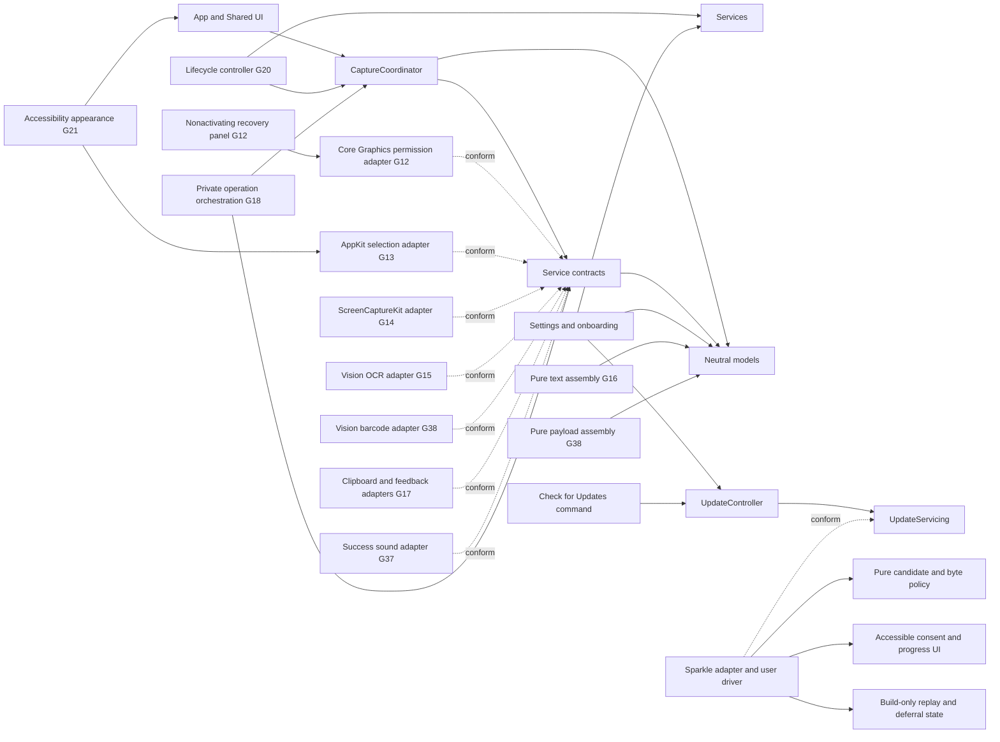
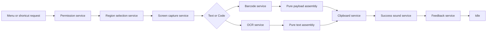

# Architecture Overview

CopyLasso currently provides a usable dockless shell plus one complete, stress-tested production service chain through clipboard output, optional success sound, and nonactivating feedback. The application includes versioned onboarding, persistent Settings, Launch at Login, one Capture shortcut, accessible native presentation, production Screen Recording permission handling, a lifecycle-safe multi-display selection overlay, in-memory ScreenCaptureKit region capture, concurrent local Vision text and code recognition with code precedence, deterministic text and payload assembly, write-only plain-text output, content-free success audio, bounded HUD feedback, and an isolated user-controlled secure updater. Feasibility evidence from G05-G07 is retained in the ADRs. G18 completed uniform cross-stage cleanup; G19-G21 hardened display, lifecycle, and presentation behavior. G36 adds authenticated update checks without placing networking or update state inside the capture workflow. G37 adds success-only audio without exposing capture content or requesting another permission. G38 adds inert on-screen code recognition inside the existing capture boundary.

## Components and Dependency Direction

- `App` owns the dockless process, scene lifecycle, menu and shortcut command routing, application termination boundary, and coalesced sleep/lock recovery. `SharedUI` contains the menu, onboarding, Settings, and auxiliary-window presentation.
- `CaptureWorkflow` owns phase transitions, cross-mode busy-state policy, and the complete operation lifecycle. Its shared command invokes permission, production selection, capture, the requested recognition adapter, pure formatting, clipboard output, content-free success audio, and bounded feedback. Cancellations and failures enter explicit terminal states and reset to idle after cleanup.
- `Services` declares narrow permission, selection, capture, text recognition, code recognition, clipboard, sound, and feedback boundaries. The Core Graphics permission, AppKit selection, ScreenCaptureKit capture, Vision text and barcode, and AppKit sound adapters are isolated here.
- `Models` contains geometry, observations, authorization observations, and feedback values without AppKit, SwiftUI, ScreenCaptureKit, or Vision dependencies.
- `Settings` owns the typed `UserDefaults` adapter, onboarding-version policy, versioned success-sound preference, shortcut storage boundary, and observable settings controller. The system login-item and sound adapters remain isolated in `Services`.
- `UpdateController` owns only automatic-check preference presentation, manual-check availability, and an updater-unavailable message. The `UpdateServicing` boundary keeps updater startup and failure independent from capture command routing.
- `SparkleUpdateService` is the sole production Sparkle import. Its delegate disables external release-note downloads and cookies; its custom user driver maps authenticated appcast items into CopyLasso's pure policy and accessible two-consent presentation.
- `SecureUpdatePolicy` validates canonical monotonic builds, replay state, inline plain-text notes, signed length, a 256 MiB ceiling, and the exact immutable GitHub enclosure URL. `SecureUpdateSessionCoordinator` owns only the active update transaction and enforces the streaming byte budget before extraction and installation.
- `UserDefaultsSecureUpdateStateStore` persists only a deferred build and highest authenticated build. Sparkle owns its ordinary automatic-check schedule and preference. No feed body, release notes, package bytes, captured pixels, recognized text, or clipboard content enter CopyLasso persistence.
- `SharedUI` owns explicit compound-control semantics, adaptive auxiliary-panel layout, and system accessibility-display observation. Selection snapshots its high-contrast drawing style when each user session begins.

Dependencies point toward contracts and neutral models. UI and platform adapters may depend on them; models and workflow state must never depend on UI or live platform frameworks.

The update graph is a sibling of the capture graph. Capture code does not import Sparkle, call the updater, or depend on update availability. Updater construction and startup failure are converted into a Settings message while the capture command remains enabled.

## Production Data Flow

The coordinator models the corresponding phases: idle, requesting permission, selecting, capturing, recognizing, completing, cancelled, and failed. It carries no mode, geometry, image, observation, assembled text, clipboard, sound, or preview payload in observable state. Menu and global-shortcut requests reach the same `CaptureCommand`. G12 performs a user-initiated Core Graphics preflight and recovery. G13 returns validated per-display geometry only after every overlay is absent. G14 enumerates shareable displays at that point and captures the outward-rounded pixel rectangle into one local `CGImage`. G19 requires the fresh display identity, full point size, scale, source bounds, and derived pixel dimensions to match the initiating snapshot before capture. G15 recognizes text with accurate corrected U.S. English Vision OCR, and G38 concurrently recognizes only the five reviewed code symbologies through a separate Vision adapter. G16 and G38 deterministically assemble their neutral observations into transient plain strings; an eligible code wins, while code-free selections fall back to text. G17 writes only eligible nonempty output and supplies bounded result-specific feedback. G37 requests content-free success audio only after that write commits. G18 and G38 keep those services inside one reusable operation, reject overlapping requests, and return to idle after success, cancellation, or failure.

Cancellation is a normal result. It enters an explicit cancelled state and returns to idle only after a reset acknowledging cleanup. Failure records only the responsible stage, never captured content, recognized text, raw platform errors, or user data. A request received outside idle is rejected without changing state.

## Concurrency and Lifetime

- `CaptureCoordinator`, permission, selection, clipboard, and feedback contracts are main-actor isolated because they coordinate application or UI state.
- The Core Graphics permission adapter performs no work during construction or launch. The singleton recovery panel is nonactivating; only its explicit **Open System Settings** action changes focus.
- The AppKit selection adapter also performs no work during construction or launch. Each user request owns at most one controller and continuation; it clears drawing, orders out every panel, restores the cursor, and releases the controller before delivering geometry on a later main-actor turn.
- The ScreenCaptureKit adapter is actor-isolated and performs enumeration only after a valid selection. It checks the current display identity, bounds, and backing scale, disables cursor and audio capture, and returns only an in-memory image of the exact configured dimensions.
- Capture and recognition contracts are asynchronous and `Sendable`.
- Both production Vision adapters perform user-initiated recognition in detached tasks away from the main actor. Cancellation calls `VNRequest.cancel()`, returns a typed cancellation result, and releases the request and input image when the operation unwinds.
- Geometry, text assembly, and code-payload assembly remain pure and independent of AppKit UI objects and Vision framework types.
- Images, recognized observations, assembled text or payloads, clipboard text, and feedback previews remain private transient values. They must be released after the active operation and must never be logged, persisted, or placed in observable coordinator state.
- The success-sound service receives only an enabled decision and a play/stop command. It never receives capture content, and playback failure cannot delay or fail a completed copy.
- One private async operation scope owns the image, observations, and full assembled string. It returns only bounded feedback after any pasteboard write. Success and failure tests hold the HUD open and prove the image has already been released while the coordinator remains busy.
- The root lifecycle controller owns no private operation payload. It cancels the command's task for sleep, screen sleep, lock/session resign, or termination, and never restarts work on wake/unlock. Fixed OSLog diagnostics contain event classes only.
- The updater service, controller, custom user driver, session coordinator, and presenter are main-actor isolated because Sparkle and AppKit presentation require the application actor. Pure update policy and streaming-byte accounting remain independent of AppKit and Sparkle types.
- One update session retains only authenticated metadata, byte counts, and Sparkle's cancellation closure. Later, Cancel, closing a cancellable panel, failure, or completion clears CopyLasso-owned session state. Sparkle owns temporary staging and removes it on transaction cancellation or failure.
- Scheduled checks default on at a 24-hour interval but perform no automatic download or installation. User-visible download and install/relaunch are separate explicit decisions.

## Goal Ownership

| Goal | Responsibility |
| --- | --- |
| G09 | Dockless menu-bar shell and shared Capture Text command |
| G10-G11 | First-run state, persistent settings, Launch at Login, and the global shortcut invoking the shared capture command |
| G12 | Production permission service and recovery UI |
| G13 | Production AppKit selection adapter |
| G14 | Production ScreenCaptureKit region capture adapter |
| G15 | Production Vision OCR adapter |
| G16 | Pure observation-to-text assembly |
| G17 | Clipboard and nonactivating feedback adapters |
| G18 | End-to-end service orchestration, cleanup, and integration tests |
| G19 | Multi-display topology, Retina, and display-snapshot hardening |
| G20 | Sleep, lock, termination, task cancellation, recovery, and safe diagnostics |
| G21 | Accessibility semantics, keyboard operation, adaptive text layout, and system appearance behavior |
| G35 | Secure-update architecture, dependency pin, threat model, and offline signature proof |
| G36 | Shipping Sparkle boundary, authenticated policy, accessible user controls, private release metadata, and update qualification |
| G37 | Original configurable success sound, versioned preference, content-free playback, and lifecycle cleanup |
| G38 | Unified on-screen QR and barcode recognition, code-first precedence, deterministic inert payload assembly, and result-specific feedback |

The G12 permission adapter, recovery panel, G13 selection overlay, G14 capture adapter, G15 and G38 Vision adapters, G16 text assembler, G38 payload assembler, G17 clipboard/HUD adapters, G18 orchestration, G36 secure updater, and G37 success-sound adapter are live in source. Captured pixels exist only as the local image shared by both recognizers; recognized observations, assembled text or payloads, and bounded previews remain transient. Pasteboard writes are confined to one service, that service never reads prior clipboard contents, and the feedback model clears on dismissal. Code payloads are never interpreted or acted on, the sound path receives no content, and the update path never receives any of those values. Automated integration covers every capture service boundary plus unified result precedence and reuse, sound policy, updater policy, replay, exact download length, consent, deferral, cancellation, retry, and failure isolation. See [Capture Workflow](capture-workflow.md) for the operation/lifetime contract, [ADR-004](ADR-004-secure-updates.md) for the update boundary, [Security and Privacy Review](../security-and-privacy-review.md) for data flow, entitlements, dependencies, trust boundaries, and misuse cases, and [Automated Coverage Review](../coverage-review.md) for regression floors and the manual ownership of uncovered system regions.
