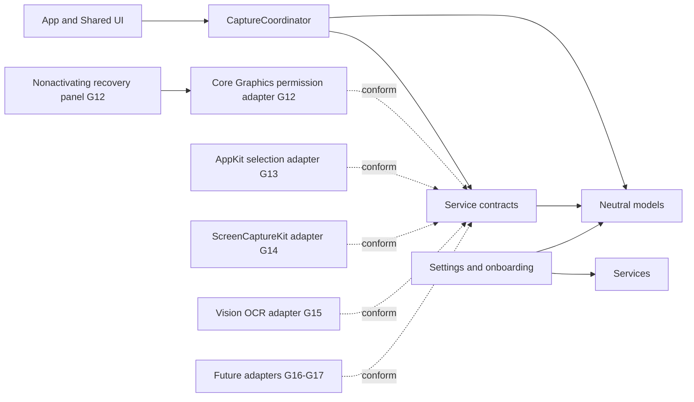

```mermaid
flowchart LR
  Request["Menu or shortcut request"] --> Permission["Permission service"]
  Permission --> Selection["Region selection service"]
  Selection --> Capture["Screen capture service"]
  Capture --> OCR["OCR service"]
  OCR --> Format["Pure text assembly"]
  Format --> Clipboard["Clipboard service"]
  Clipboard --> Feedback["Feedback service"]
  Feedback --> Idle["Idle"]
```

# Architecture Overview

CopyLasso currently provides a usable dockless shell plus the permission, selection, pixel-capture, and text-recognition portion of its production architecture, not an end-to-end clipboard workflow. The application includes versioned onboarding, persistent Settings, Launch at Login, a configurable global shortcut, production Screen Recording permission handling, a lifecycle-safe multi-display selection overlay, in-memory ScreenCaptureKit region capture, and local Vision OCR. Feasibility evidence from G05-G07 is retained in the ADRs, while text assembly, clipboard, and feedback are added in G16-G17 and connected in G18.

## Components and Dependency Direction

- `App` owns the dockless process, scene lifecycle, menu and shortcut command routing, and application termination boundary. `SharedUI` contains the menu, onboarding, Settings, and auxiliary-window presentation.
- `CaptureWorkflow` owns phase transitions and busy-state policy. Its current command slice invokes permission, production selection, capture, and OCR, then stops at the G16 formatting boundary.
- `Services` declares narrow permission, selection, capture, OCR, clipboard, and feedback boundaries. The Core Graphics permission, AppKit selection, ScreenCaptureKit capture, and Vision OCR adapters are isolated here.
- `Models` contains geometry, observations, authorization observations, and feedback values without AppKit, SwiftUI, ScreenCaptureKit, or Vision dependencies.
- `Settings` owns the typed `UserDefaults` adapter, onboarding-version policy, shortcut storage boundary, and observable settings controller. The system login-item adapter remains isolated in `Services`.

Dependencies point toward contracts and neutral models. UI and platform adapters may depend on them; models and workflow state must never depend on UI or live platform frameworks.

## Production Data Flow

The coordinator models the corresponding phases: idle, requesting permission, selecting, capturing, recognizing, completing, cancelled, and failed. It carries no geometry, image, or recognized-text payload in observable state. Menu and global-shortcut requests reach the same `CaptureCommand`. G12 performs a user-initiated Core Graphics preflight and recovery. G13 returns validated per-display geometry only after every overlay is absent. G14 enumerates shareable displays at that point, validates the selected display and scale, and captures the outward-rounded pixel rectangle into one local `CGImage`. G15 recognizes that image with accurate corrected U.S. English Vision OCR and returns transient neutral observations before the current command stops at the G16 formatting boundary. G18 will connect the complete service chain through a private transient operation context.

Cancellation is a normal result. It enters an explicit cancelled state and returns to idle only after a reset acknowledging cleanup. Failure records only the responsible stage, never captured content, recognized text, raw platform errors, or user data. A request received outside idle is rejected without changing state.

## Concurrency and Lifetime

- `CaptureCoordinator`, permission, selection, clipboard, and feedback contracts are main-actor isolated because they coordinate application or UI state.
- The Core Graphics permission adapter performs no work during construction or launch. The singleton recovery panel is nonactivating; only its explicit **Open System Settings** action changes focus.
- The AppKit selection adapter also performs no work during construction or launch. Each user request owns at most one controller and continuation; it clears drawing, orders out every panel, restores the cursor, and releases the controller before delivering geometry on a later main-actor turn.
- The ScreenCaptureKit adapter is actor-isolated and performs enumeration only after a valid selection. It checks the current display identity, bounds, and backing scale, disables cursor and audio capture, and returns only an in-memory image of the exact configured dimensions.
- Capture and OCR contracts are asynchronous and `Sendable`.
- The production Vision adapter performs user-initiated recognition in a detached task away from the main actor. Cancellation calls `VNRequest.cancel()`, returns a typed cancellation result, and releases the request and input image when the operation unwinds.
- Geometry and future text assembly remain pure and independent of AppKit UI objects and Vision framework types.
- Images, recognized observations, assembled text, clipboard text, and feedback previews remain private transient values. They must be released after the active operation and must never be logged, persisted, or placed in observable coordinator state.

## Goal Ownership

| Goal | Responsibility |
| --- | --- |
| G09 | Dockless menu-bar shell and shared Capture Text command |
| G10-G11 | First-run state, persistent settings, Launch at Login, and the global shortcut invoking the shared capture command |
| G12 | Production permission service and recovery UI |
| G13 | Production AppKit selection adapter |
| G14 | Production ScreenCaptureKit region capture adapter |
| G15 | Production Vision OCR adapter |
| G16 | Pure observation-to-text assembly |
| G17 | Clipboard and nonactivating feedback adapters |
| G18 | End-to-end service orchestration, cleanup, and integration tests |

The G12 permission adapter, recovery panel, G13 selection overlay, G14 capture adapter, and G15 Vision adapter are live. Captured pixels exist only as the local image passed to OCR; recognized observations remain neutral transient values and are discarded at the pending formatting boundary. Clipboard and feedback still have only contracts and test doubles. No hidden pasteboard or feedback workflow exists.
