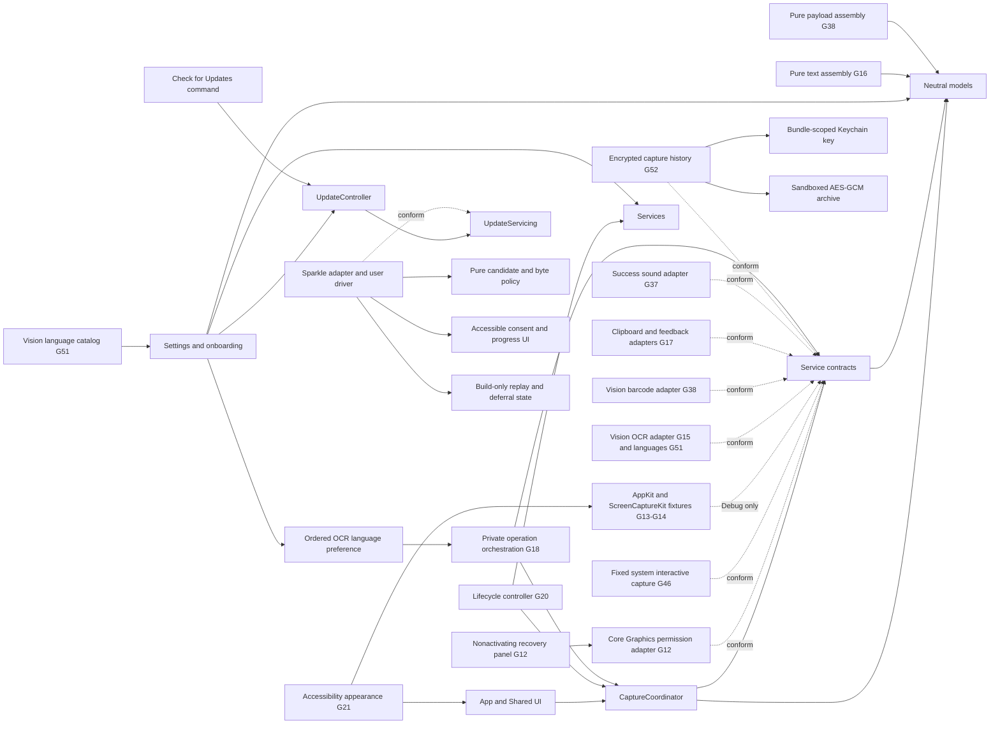

# Architecture Overview

CopyLasso currently provides a usable dockless shell plus one complete, stress-tested production service chain through clipboard output, optional success sound, and nonactivating feedback. The application includes versioned onboarding, persistent Settings, Launch at Login, one Capture shortcut, accessible native presentation, production Screen Recording permission handling, Apple's focus-preserving interactive region selector paired with in-memory ScreenCaptureKit capture, concurrent local Vision text and code recognition with code precedence, deterministic text and payload assembly, write-only plain-text output, content-free success audio, bounded HUD feedback, and an isolated user-controlled secure updater. Feasibility evidence from G05-G07 is retained in the ADRs. G18 completed uniform cross-stage cleanup; G19-G21 hardened display, lifecycle, and presentation behavior. G36 adds authenticated update checks without placing networking or update state inside the capture workflow. G37 adds success-only audio without exposing capture content or requesting another permission. G38 adds inert on-screen code recognition inside the existing capture boundary. G39 records a no-go for offline LaTeX recognition, so no LaTeX runtime, model, or production path enters this graph. G40A freezes the reviewed candidate-17 sound, and G41 qualifies exactly that feature graph as `0.2.0 (3)` without adding another runtime boundary. G42 and G43 qualified and published those same immutable application bytes. G43A later changed only the source presentation of authenticated release notes, and G46 replaced the source-only cursor handoff with the native system selector. G48 qualified those merged maintenance changes as `0.2.1 (4)` without adding a processing indicator or another runtime boundary; G49 published those exact application bytes and authenticated update metadata. G50 publishes `0.2.2 (5)` as a dependency-only Sparkle security hotfix with no new feature or runtime boundary. G51 adds an unreleased, runtime-derived OCR language catalog and ordered local preference. G52 adds a separate default-off encrypted capture-history boundary for successful output only; it never receives screenshots and adds no dependency, entitlement, permission, network path, capture command, or public version change.

## Components and Dependency Direction

```mermaid
flowchart LR
  App["App and Shared UI"] --> Coordinator["CaptureCoordinator"]
  Appearance["Accessibility appearance G21"] --> App
  Appearance --> DebugCapture
  Lifecycle["Lifecycle controller G20"] --> Coordinator
  Lifecycle --> Services
  Coordinator --> Contracts["Service contracts"]
  Coordinator --> Models["Neutral models"]
  Contracts --> Models
  Settings["Settings and onboarding"] --> Services
  Settings --> Models
  Settings --> Updates["UpdateController"]
  UpdateMenu["Check for Updates command"] --> Updates
  Updates --> UpdateBoundary["UpdateServicing"]
  Sparkle["Sparkle adapter and user driver"] -. conform .-> UpdateBoundary
  Sparkle --> UpdatePolicy["Pure candidate and byte policy"]
  Sparkle --> UpdateUI["Accessible consent and progress UI"]
  Sparkle --> UpdateState["Build-only replay and deferral state"]
  Permission["Core Graphics permission adapter G12"] -. conform .-> Contracts
  Recovery["Nonactivating recovery panel G12"] --> Permission
  InteractiveCapture["Fixed system interactive capture G46"] -. conform .-> Contracts
  DebugCapture["AppKit and ScreenCaptureKit fixtures G13-G14"] -. Debug only .-> Contracts
  OCR["Vision OCR adapter G15 and languages G51"] -. conform .-> Contracts
  LanguageCatalog["Vision language catalog G51"] --> Settings
  Settings --> LanguagePreference["Ordered OCR language preference"]
  LanguagePreference --> Workflow
  Format["Pure text assembly G16"] --> Models
  Barcode["Vision barcode adapter G38"] -. conform .-> Contracts
  CodeFormat["Pure payload assembly G38"] --> Models
  Output["Clipboard and feedback adapters G17"] -. conform .-> Contracts
  Sound["Success sound adapter G37"] -. conform .-> Contracts
  History["Encrypted capture history G52"] -. conform .-> Contracts
  History --> HistoryKey["Bundle-scoped Keychain key"]
  History --> HistoryArchive["Sandboxed AES-GCM archive"]
  Workflow["Private operation orchestration G18"] --> Contracts
  Workflow --> Coordinator
```

- `App` owns the dockless process, scene lifecycle, menu and shortcut command routing, application termination boundary, and coalesced sleep/lock recovery. `SharedUI` contains the menu, onboarding, Settings, and auxiliary-window presentation.
- `CaptureWorkflow` owns phase transitions, cross-mode busy-state policy, and the complete operation lifecycle. Its shared command invokes permission, one interactive capture, both recognition adapters, pure formatting, clipboard output, content-free success audio, and bounded feedback. Cancellations and failures enter explicit terminal states and reset to idle after cleanup.
- `Services` declares narrow permission, interactive capture, selection geometry, ScreenCaptureKit capture, text recognition, code recognition, clipboard, sound, and feedback boundaries. Production starts only the fixed `/usr/sbin/screencapture -i -s -x -t png /dev/null` contract directly through `Process`; no shell or caller-controlled argument enters that boundary. Shortcut routing first waits for its Shift/Option/Control modifiers to be released. A selection-scoped one-millisecond sampler retains only pointer position, left-button state, and Shift/Option/Space geometry-adjustment state, waits out any preexisting press, permits a later real drag to replace a tiny confirmation click, rejects adjusted geometry, and uses half-open display bounds so a shared edge belongs to exactly one display. It fails closed when the release lands on another known display before the derived rectangle reaches the existing ScreenCaptureKit adapter. It installs no event monitor or event tap. The AppKit overlay remains available only to explicit Debug fixture modes.
- `Models` contains geometry, observations, authorization observations, and feedback values without AppKit, SwiftUI, ScreenCaptureKit, or Vision dependencies.
- `Settings` owns the typed `UserDefaults` adapter, onboarding-version policy, versioned success-sound and OCR-language preferences, history consent and observable controller, shortcut storage boundary, and observable settings controller. The OCR editor validates its searchable, ordered selection against the accurate revision-3 Vision catalog exposed by one narrow service. The system login-item, sound, Keychain, and encrypted-file adapters remain isolated in `Services`.
- `UpdateController` owns only automatic-check preference presentation, manual-check availability, and an updater-unavailable message. The `UpdateServicing` boundary keeps updater startup and failure independent from capture command routing.
- `SparkleUpdateService` is the sole production Sparkle import. Its delegate disables external release-note downloads and cookies; its custom user driver maps authenticated appcast items into CopyLasso's pure policy and accessible two-consent presentation. Authenticated inline notes become inert semantic blocks in a bounded, scrollable native offer panel; their links are never activated.
- `SecureUpdatePolicy` validates canonical monotonic builds, replay state, inline plain-text notes, signed length, a 256 MiB ceiling, and the exact immutable GitHub enclosure URL. `SecureUpdateSessionCoordinator` owns only the active update transaction and enforces the streaming byte budget before extraction and installation.
- `UserDefaultsSecureUpdateStateStore` persists only a deferred build and highest authenticated build. Sparkle owns its ordinary automatic-check schedule and preference. No feed body, release notes, package bytes, or captured pixels enter CopyLasso persistence. G52's separately consented history adapter is the only boundary that may persist successful recognized output.
- `SharedUI` owns explicit compound-control semantics, adaptive auxiliary-panel layout, and system accessibility-display observation. Selection snapshots its high-contrast drawing style when each user session begins.

Dependencies point toward contracts and neutral models. UI and platform adapters may depend on them; models and workflow state must never depend on UI or live platform frameworks.

The update graph is a sibling of the capture graph. Capture code does not import Sparkle, call the updater, or depend on update availability. Updater construction and startup failure are converted into a Settings message while the capture command remains enabled.

## Production Data Flow

```mermaid
flowchart LR
  Request["Menu or shortcut request"] --> Permission["Permission service"]
  Permission --> Selection["Region selection service"]
  Selection --> Capture["Screen capture service"]
  Capture --> Mode{"Text or Code"}
  Mode --> OCR["OCR service"]
  Mode --> Barcode["Barcode service"]
  OCR --> Format["Pure text assembly"]
  Barcode --> CodeFormat["Pure payload assembly"]
  CodeFormat --> Clipboard
  Format --> Clipboard["Clipboard service"]
  Clipboard --> Sound["Success sound service"]
  Sound --> History{"History enabled?"}
  History -->|"yes"| Encrypted["Encrypted history store"]
  History -->|"no"| Feedback["Feedback service"]
  Encrypted --> Feedback
  Feedback --> Idle["Idle"]
```

The coordinator models the corresponding phases: idle, requesting permission, selecting, capturing, recognizing, completing, cancelled, and failed. It carries no mode, geometry, image, observation, assembled text, clipboard, sound, or preview payload in observable state. Menu and global-shortcut requests reach the same `CaptureCommand`. G12 performs a user-initiated Core Graphics preflight and recovery. G13 returns validated per-display geometry only after every overlay is absent. G14 enumerates shareable displays at that point and captures the outward-rounded pixel rectangle into one local `CGImage`. G19 requires the fresh display identity, full point size, scale, source bounds, and derived pixel dimensions to match the initiating snapshot before capture. G15 recognizes text with accurate corrected Vision OCR; G51 snapshots the user's validated ordered languages when a request is accepted and enables automatic detection only for a multi-language selection. G38 concurrently recognizes only the five reviewed code symbologies through a separate Vision adapter. G16 and G38 deterministically assemble their neutral observations into transient plain strings; an eligible code wins, while code-free selections fall back to text. G17 writes only eligible nonempty output and supplies bounded result-specific feedback. G37 requests content-free success audio only after that write commits. G52 optionally sends that exact successful output and its Text/Code type to the encrypted recorder; a storage failure changes only bounded feedback. G18 and G38 keep those services inside one reusable operation, reject overlapping requests, and return to idle after success, cancellation, or failure.

Cancellation is a normal result. It enters an explicit cancelled state and returns to idle only after a reset acknowledging cleanup. Failure records only the responsible stage, never captured content, recognized text, raw platform errors, or user data. A request received outside idle is rejected without changing state.

## Concurrency and Lifetime

- `CaptureCoordinator`, permission, selection, clipboard, and feedback contracts are main-actor isolated because they coordinate application or UI state.
- The Core Graphics permission adapter performs no work during construction or launch. After an empty native-selector result, ScreenCaptureKit performs a content-free authoritative access check so stale preflight state cannot hide denial. The singleton recovery panel is nonactivating; only its explicit **Open System Settings** action changes focus.
- The production interactive-capture service starts the system selector synchronously after granted shortcut preflight, so macOS owns cursor and focus behavior. It derives one display-clamped rectangle from transient pointer/button samples, receives no subprocess image output, and suppresses stale completion after cancellation or replacement. The ScreenCaptureKit adapter then validates current display identity, full global bounds, scale, source bounds, and pixel geometry before returning only those pixels in memory.
- Because the sampler observes rather than intercepts input, it cannot atomically suppress an exact Control-at-mouse-up screenshot redirect, distinguish every dragged first-use confirmation followed by Escape, or prove an entire press/drag/release that occurs between two samples. These accepted native-selector residuals are documented publicly; adding an event tap or local input owner would require a different permission or would replace the physically reliable focus-preserving handoff.
- The AppKit selection adapter remains a deterministic Debug boundary for overlay regression coverage. ScreenCaptureKit geometry and pixel-crop validation are shared by normal Debug, Release, and explicit fixtures.
- Capture and recognition contracts are asynchronous and `Sendable`.
- Both production Vision adapters perform user-initiated recognition in detached tasks away from the main actor. Cancellation calls `VNRequest.cancel()`, returns a typed cancellation result, and releases the request and input image when the operation unwinds.
- Geometry, text assembly, and code-payload assembly remain pure and independent of AppKit UI objects and Vision framework types.
- Images and recognized observations remain private transient values and are never persisted. Assembled output, clipboard text, and feedback previews must never be logged or placed in observable coordinator state; only exact successful output may cross the explicitly enabled G52 encrypted-history boundary.
- The success-sound service receives only an enabled decision and a play/stop command. It never receives capture content, and playback failure cannot delay or fail a completed copy.
- One private async operation scope owns the image, observations, and full assembled string. The interactive outcome is confined to a nested scope that returns only bounded feedback after any pasteboard write, so both capture paths release pixels before HUD presentation. Success and failure tests hold the HUD open and prove the image has already been released while the coordinator remains busy.
- The root lifecycle controller owns no private operation payload. It cancels the command's task for sleep, screen sleep, lock/session resign, or termination, and never restarts work on wake/unlock. Fixed OSLog diagnostics contain event classes only.
- The updater service, controller, custom user driver, session coordinator, and presenter are main-actor isolated because Sparkle and AppKit presentation require the application actor. Pure update policy and streaming-byte accounting remain independent of AppKit and Sparkle types.
- One update session retains only authenticated metadata, byte counts, and Sparkle's cancellation closure. Later, Cancel, closing a cancellable panel, failure, or completion clears CopyLasso-owned session state. Sparkle owns temporary staging and removes it on transaction cancellation or failure.
- Scheduled checks default on at a 24-hour interval but perform no automatic download or installation. User-visible download and install/relaunch are separate explicit decisions.

## Goal Ownership

| Goal | Responsibility |
| --- | --- |
| G09 | Dockless menu-bar shell and shared Capture Text command |
| G10-G11 | First-run state, persistent settings, Launch at Login, and the global shortcut invoking the shared capture command |
| G12 | Production permission service and recovery UI |
| G13 | Production AppKit selection adapter |
| G14 | Production ScreenCaptureKit region capture adapter |
| G15 | Production Vision OCR adapter |
| G16 | Pure observation-to-text assembly |
| G17 | Clipboard and nonactivating feedback adapters |
| G18 | End-to-end service orchestration, cleanup, and integration tests |
| G19 | Multi-display topology, Retina, and display-snapshot hardening |
| G20 | Sleep, lock, termination, task cancellation, recovery, and safe diagnostics |
| G21 | Accessibility semantics, keyboard operation, adaptive text layout, and system appearance behavior |
| G35 | Secure-update architecture, dependency pin, threat model, and offline signature proof |
| G36 | Shipping Sparkle boundary, authenticated policy, accessible user controls, private release metadata, and update qualification |
| G37 | Original configurable success sound, versioned preference, content-free playback, and lifecycle cleanup |
| G38 | Unified on-screen QR and barcode recognition, code-first precedence, deterministic inert payload assembly, and result-specific feedback |
| G39 | Non-production offline LaTeX model/runtime comparison and no-go decision in [ADR-005](ADR-005-offline-latex-recognition.md) |
| G40A | Maintainer-selected candidate-17 success-sound bytes with the existing playback contract |
| G41 | Release-level v0.2 integration audit, metadata freeze, qualification evidence, and G42 workflow source enablement |
| G42 | Immutable private v0.2 release-candidate qualification and updater-path approval |
| G43 | Signed-tag, GitHub release, authenticated feed, and public-install publication |
| G43A | Post-publication bounded native release-note presentation fix; public v0.2.0 bytes unchanged |
| G44 | Public release-state documentation, immutable-state readback, and shipped-issue closure |
| G45 | Privileged workflow, archive, candidate, update-metadata, and nested-code hardening |
| G46 | Concise product copy, focus-preserving native system selector, transient geometry handoff to ScreenCaptureKit, and cursor-readiness product polish |
| G48 | `0.2.1 (4)` maintenance-source freeze and private candidate qualification; no new runtime boundary |
| G49 | Immutable v0.2.1 publication, authenticated feed deployment, public updater smoke, and release-state closure; no runtime change |
| G50 | `0.2.2 (5)` Sparkle security hotfix, immutable publication, authenticated feed deployment, and release-state closure; no feature or runtime-boundary change |
| G51 | Unreleased runtime-derived multilingual OCR settings, ordered per-capture language snapshots, and v0.3 source contract |
| G52 | Off-by-default AES-256-GCM capture history with seven-day/100-entry retention, scoped Keychain ownership, and native History UI |

The G12 permission adapter and recovery panel, G46 interactive capture, G15 and G38 Vision adapters, G16 text assembler, G38 payload assembler, G17 clipboard/HUD adapters, G18 orchestration, G36 secure updater, G37 success-sound adapter, and G52 encrypted-history adapter are live in normal source execution. G13 remains an explicit Debug overlay fixture, while G14's ScreenCaptureKit validation is reused by production. Captured pixels exist only in the local image shared by both recognizers; recognized observations and bounded previews remain transient. Pasteboard writes are confined to one service, that service never reads prior clipboard contents, and the feedback model clears on dismissal. Exact successful assembled output may enter only the separately consented G52 archive. Code payloads are never interpreted or acted on, the sound path receives no content, and the update path never receives any of those values. Automated integration covers every capture service boundary plus unified result precedence and reuse, history consent/retention/failure isolation, sound policy, updater policy, replay, exact download length, deferral, cancellation, and retry. See [Capture Workflow](capture-workflow.md) for the operation/lifetime contract, [Capture History](capture-history.md) for the encrypted persistence boundary, [ADR-004](ADR-004-secure-updates.md) for the update boundary, [ADR-005](ADR-005-offline-latex-recognition.md) for the deferred LaTeX decision, [Security and Privacy Review](../security-and-privacy-review.md) for data flow, entitlements, dependencies, trust boundaries, and misuse cases, and [Automated Coverage Review](../coverage-review.md) for regression floors and the manual ownership of uncovered system regions.
